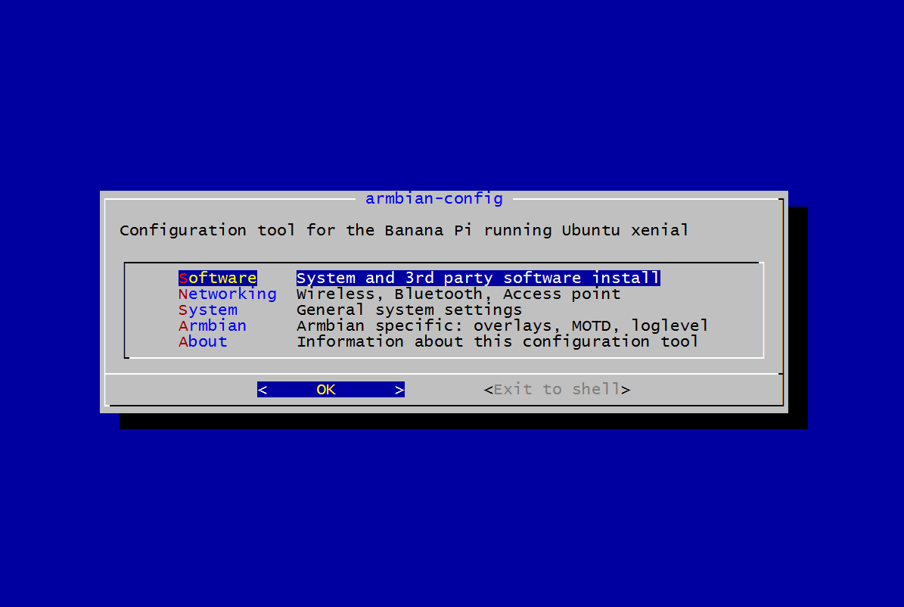
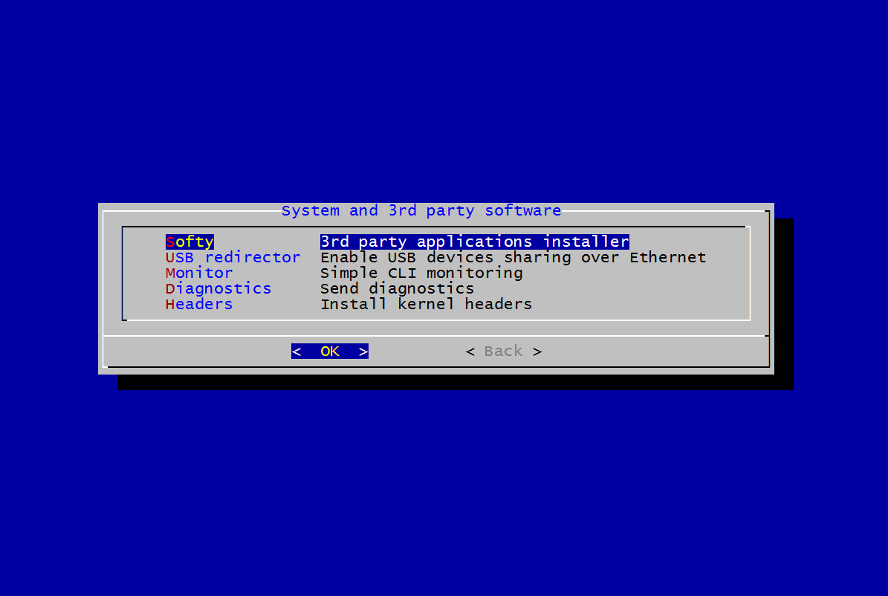
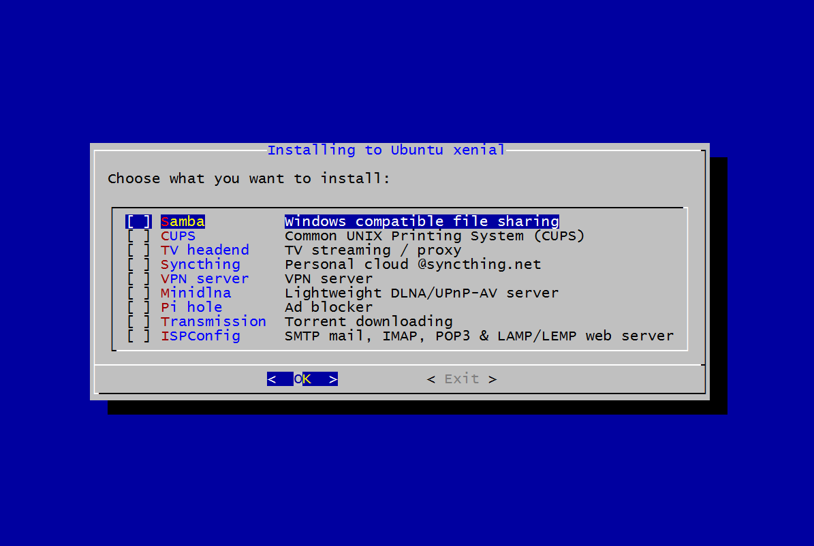
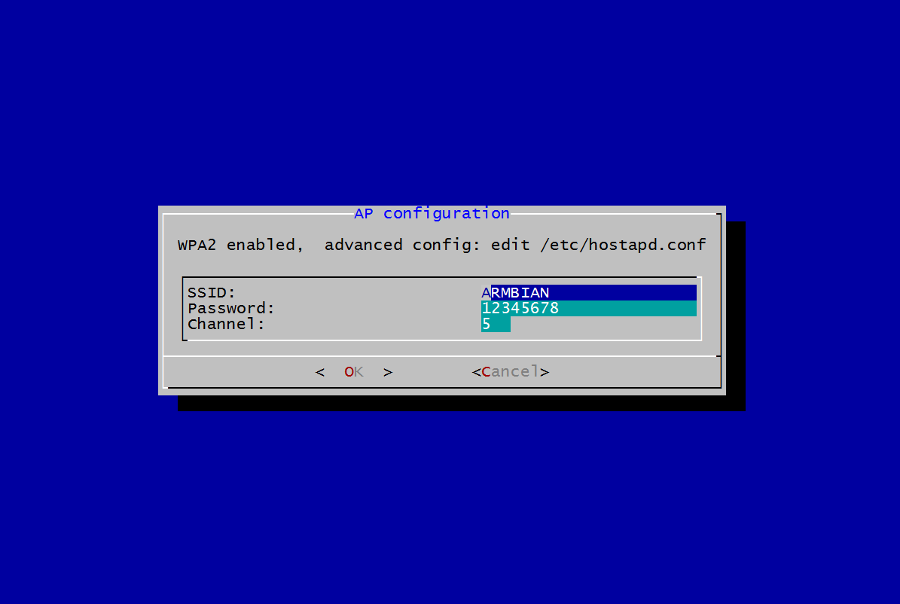
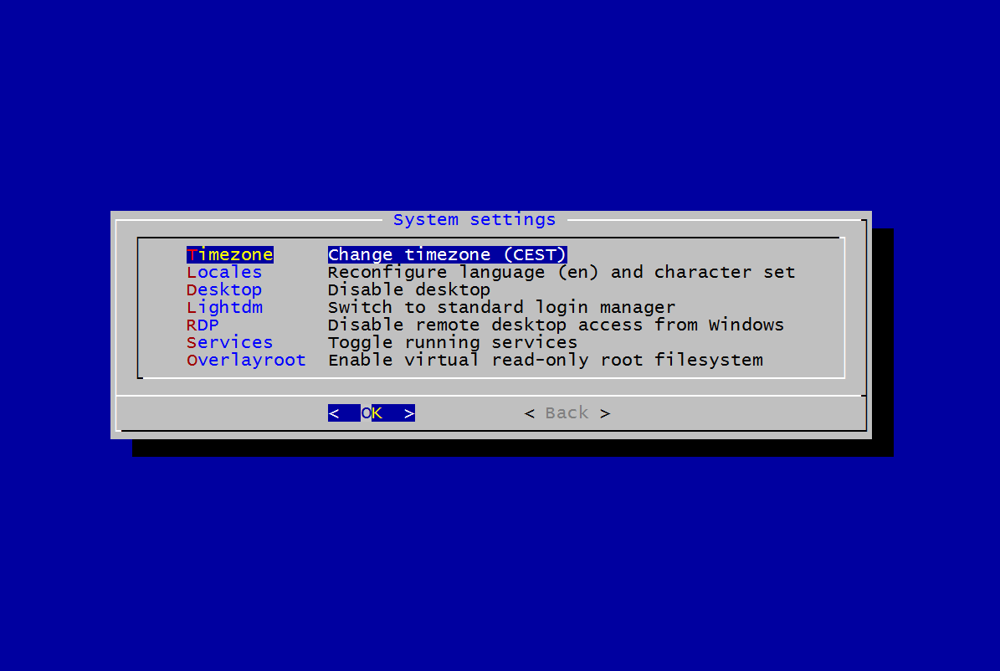
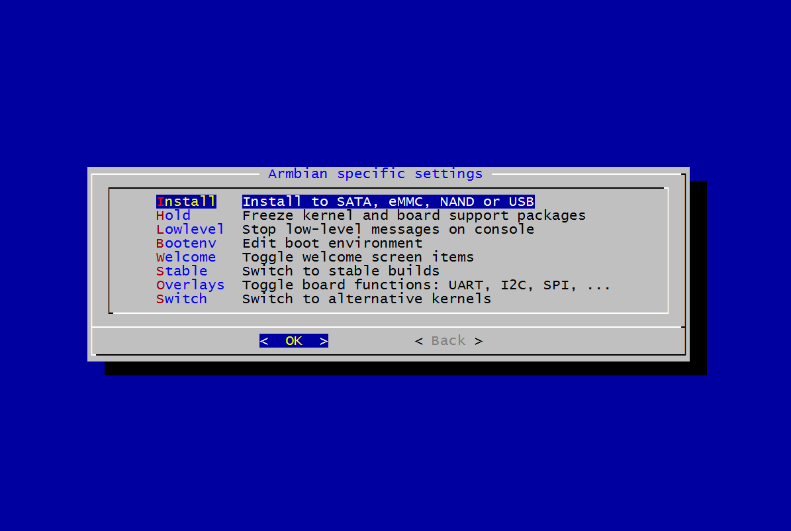
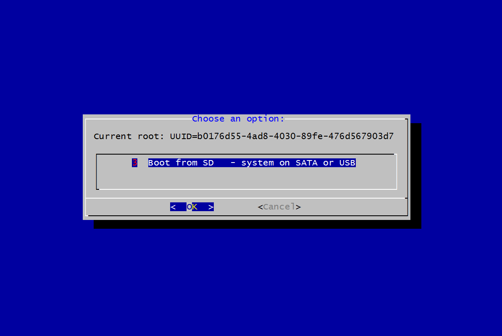
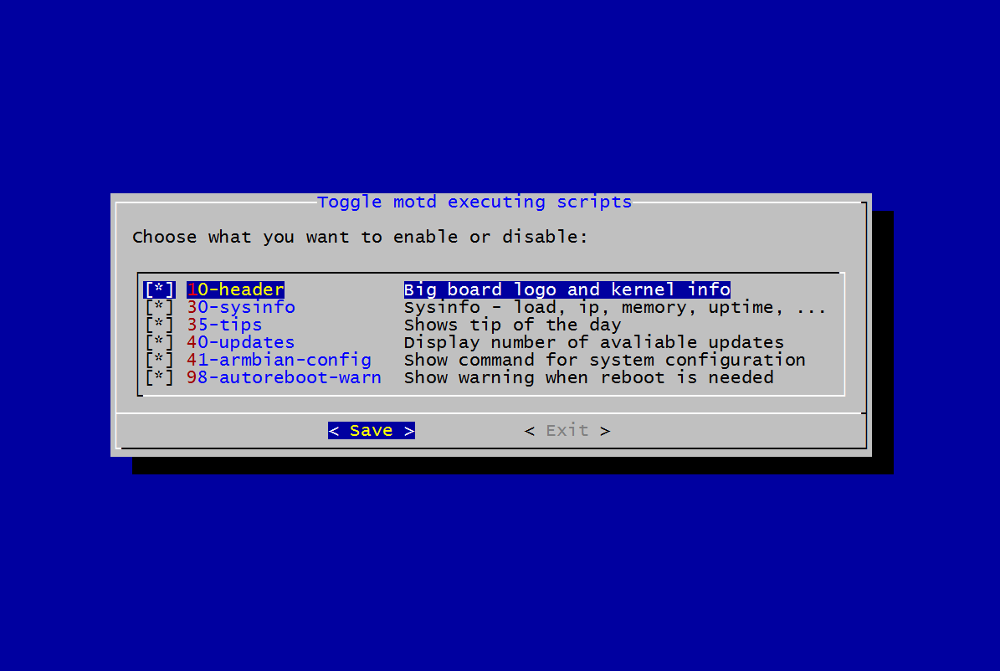
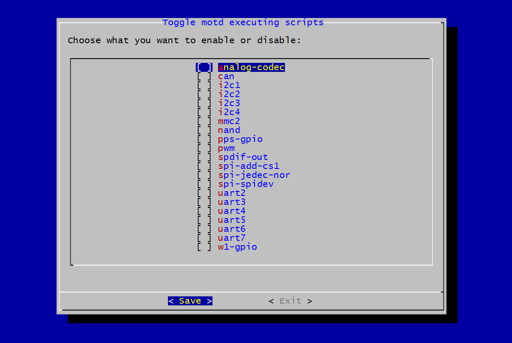

# Armbian configuration utility #

## Overview ##

Configuration tool for:

- software install
- networking configuration
- general system settings
- board specific functions

## Software ##

- softy	 
	- [TV headend](https://tvheadend.org/) *(IPTV server)*
	- [Syncthing](https://syncthing.net/) *(personal cloud)*
	- [SoftEther VPN server](https://www.softether.org/) *(VPN server)*
	- [Transmission](https://transmissionbt.com/) *(torrent server)*
	- [ISPConfig](https://www.ispconfig.org/) *(WEB & MAIL server)*
	- [Openmediavault NAS](http://www.openmediavault.org/) *(NAS server)*
	- [PI hole](https://pi-hole.net) *(ad blocker)*
	- [MiniDLNA](http://minidlna.sourceforge.net/) *(media sharing)*
- monitor = simple CLI monitoring- 
- diagnostics = create a log summary and upload to paste.bin
- headers = install kernel headers

## Networking  ##

- select dynamic or edit static IP address
- create or manage WiFi access point
- connect with Wifi
- pair Bluetooth devices
- edit network config manually

## System  ##

- change timezone
- reconfigure language
- toggle desktop
- toggle login manager
- toggle RDP
- manage services
- enable overlayroot (Ubuntu)   

## Armbian  ##

- Install to SATA, eMMC, NAND or USB
- Freeze / unfreeze kernel and board support packages
- Edit boot environment
- Edit boot script
- Toggle welcome screen items
- Switch between nightly and stable builds
- Switch to alternative kernels
- Toggle board functions: UART, I2C, SPI, ...

## Resources ##

[Sources](https://github.com/armbian/config)