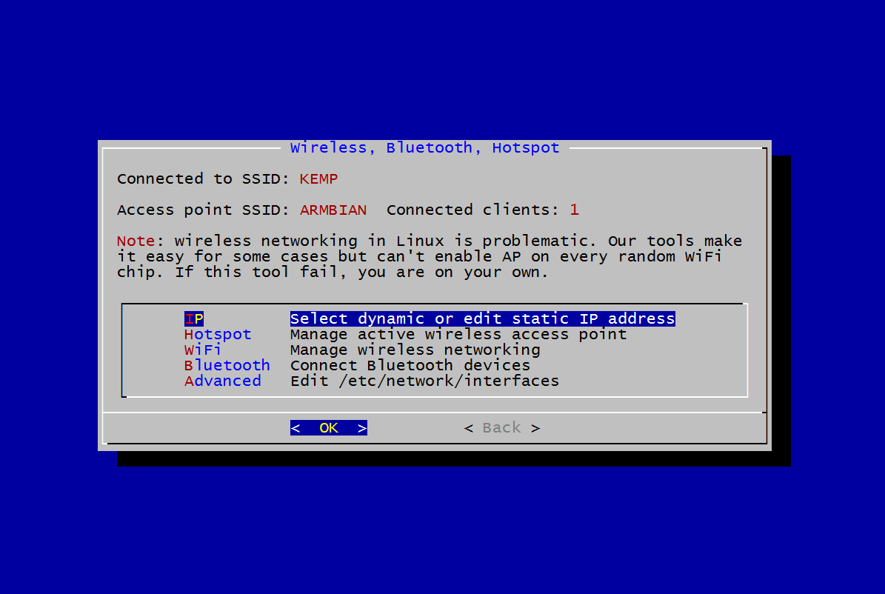

# Armbian configuration utility #

Is a base utility for configuring your board.

- software install
- networking configuration
- general system settings
- board specific functions

## Software ##

Software installation menu provides automated install of the following packages. Most of the software will work on newer versions without a problem, but there is no warranty.

- softy	 
	- [TV headend](https://tvheadend.org/) *(IPTV server)*
	- [Syncthing](https://syncthing.net/) *(personal cloud)*
	- [SoftEther VPN](https://www.softether.org/) *(VPN server & client)*
	- [Transmission](https://transmissionbt.com/) *(torrent server)*
	- [ISPConfig](https://www.ispconfig.org/) *(WEB & MAIL server)*
	- [Openmediavault NAS](http://www.openmediavault.org/) *(NAS server)*
	- [PI hole](https://pi-hole.net) *(ad blocker)*
	- [MiniDLNA](http://minidlna.sourceforge.net/) *(media sharing)*

- monitor = simple CLI monitoring 
- diagnostics = create a summary of logs and upload them to paste.bin
- headers = install kernel headers, which are needed for some external module recompilation

## Networking  ##

Ethernet adapter is managed by Network Manager by default, while Wireless is handled by IFUPDOWN, from within /etc/network/interfaces

 
- choose to select dynamic or set static IP address
- create WiFi access point. If your wireless adapter is recognized by a kernel, then our utility proceeds with auto mode detection on the selected device. It can detect 802.11n, 802.11a and 802.11ac. It also knows how to handle some special Realtek adapters. 
- manage WiFi access point. You can alter name, password or channel. If you have more understanding you can edit hostapd.conf directly from this utility
- connect with Wifi. You can create multiple wireless connections at the same time. They are managed by Network Manager.
- pair Bluetooth devices without PIN code
- edit network config manually

There is no need to reboot. All changes are done on the fly.

## System  ##

- change timezone
- reconfigure language / locales
- toggle desktop on and off (on desktop images)
- change login managers from none to lightdm (on desktop images)
- toggle RDP - remote desktop from Windows (on desktop images)
- manage stock Debian / Ubuntu services
- toggle overlayroot (Ubuntu)

## Armbian  ##

- Install to SATA, eMMC, NAND or USB - it gives you an option to install a system to more resilient and faster media
- Freeze/unfreeze kernel and board support packages. For safer system updates.
- Edit boot environment. Change boot verbosity level, video mode, etc.
- Edit boot script.
- Toggle welcome screen items
- Switch between nightly and stable builds
- Switch to alternative kernels
- Toggle board functions: UART, I2C, SPI, ...

## Resources ##

The configurating utility can be installed to generic Debian system while some Armbian specifics function will not work.

[Sources](https://github.com/armbian/config)